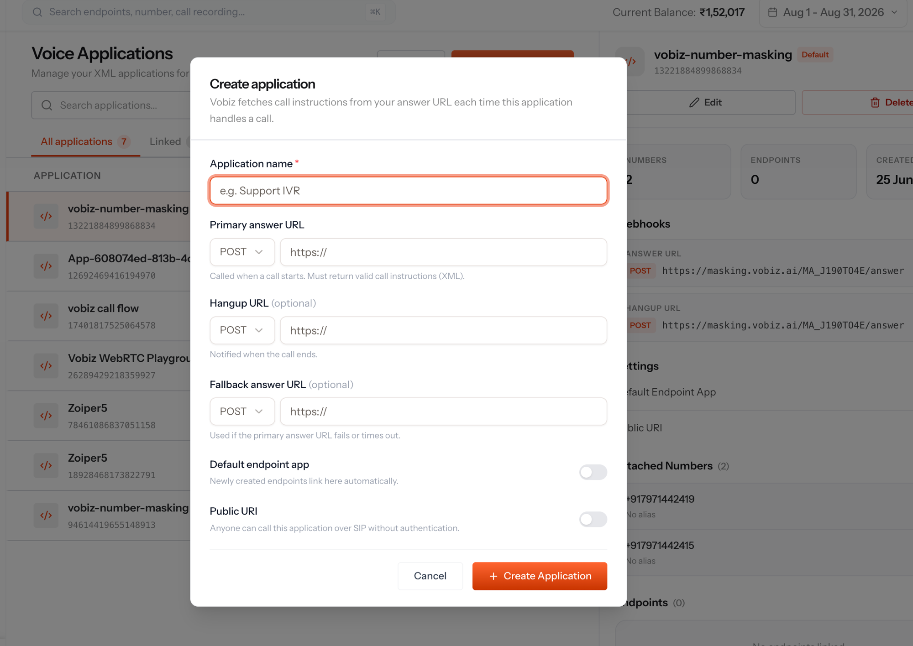
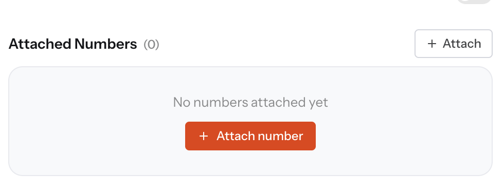

# Vobiz Deepgram Voice Agent

A real-time phone agent built on the [Vobiz](https://vobiz.ai) XML API and the
[Deepgram Voice Agent API](https://developers.deepgram.com/docs/voice-agent). A caller speaks
naturally, the agent answers, and the caller can interrupt it mid-sentence.

Vobiz streams the call audio over a bidirectional WebSocket. This server is a thin audio bridge —
it forwards the caller's audio into one Deepgram Voice Agent socket and plays the agent's audio
back. Deepgram runs the whole conversation loop: speech-to-text, the LLM, text-to-speech, and
turn-taking.

## Call Flow

```
Caller ──PSTN──> Vobiz ──media events──────> app.py ──send_media──> Deepgram Voice Agent
Caller <──PSTN── Vobiz <──playAudio events── app.py <────bytes───── (Flux STT · LLM · Flux TTS)
                                               ^
                           UserStartedSpeaking ─┘ → clearAudio (barge-in)
```

1. Vobiz fetches `/answer` and receives a `<Stream>` element.
2. Vobiz opens a WebSocket to `/media/<secret>` and sends a `start` event.
3. Caller audio arrives as `media` events and is forwarded to Deepgram.
4. Agent audio comes back as raw bytes and goes to Vobiz as `playAudio` events.
5. When the caller interrupts, Deepgram signals it and the app sends `clearAudio`.
6. After each turn a `checkpoint` is sent; Vobiz replies `playedStream` once the caller has
   actually heard it.

## Endpoints

| Method | Path | Description |
|--------|------|-------------|
| GET/POST | `/answer` | Entry point — returns the `<Stream>` XML |
| WS | `/media/<secret>` | Bidirectional media stream |
| POST | `/stream-status` | `<Stream statusCallbackUrl>` — StartStream, PlayedStream, StopStream |
| POST | `/hangup` | Call ended webhook |
| GET | `/health` | Resolved URLs and audio profile |

## Setup

```bash
python3 -m venv .venv && source .venv/bin/activate
pip install -r requirements.txt
cp .env.example .env
# Edit .env with your values
python app.py
```

Expose the server publicly — `GET /health` echoes the URLs and audio profile it resolved.
Whichever host you use becomes the answer URL in the two sections below.

## Inbound Calls

Vobiz decides what to do with an inbound call by looking up the **Voice Application** attached
to the number that was dialled. So a number alone is not enough: create an application pointing
at your answer URL, then attach a number to it.

### 1. Create a Voice Application

In the Vobiz console, go to **Voice Applications → Create application**. Set **Primary answer
URL** to `https://YOUR_HOST/answer` with method **POST**. Optionally set the **Hangup URL** to
`https://YOUR_HOST/hangup` to receive the call-ended webhook.



### 2. Attach a number

Open the application and attach one of your DIDs under **Attached Numbers → Attach number**.
Calls to that number now fetch XML from your answer URL.



Dial the attached number with a `0` or `+91` prefix — `09XXXXXXXXX` or `+919XXXXXXXXX`.
You should hear the greeting.

## Outbound Calls

`call.py` places a call and points it at this server, so no Voice Application is needed:

```bash
python call.py --to +919XXXXXXXXX
```

## Environment Variables

| Variable | Required | Description |
|----------|----------|-------------|
| `DEEPGRAM_API_KEY` | Yes | Runs the whole agent — STT, LLM, and TTS |
| `PUBLIC_HOSTNAME` | Yes | Public host Vobiz reaches, no scheme |
| `HTTP_PORT` | No | Server port (default: `5050`) |
| `AUDIO_MODE` | No | `mulaw` (default) or `l16` — see [Audio](#audio) |
| `STREAM_SECRET` | No | Alphanumeric secret placed in the media stream's URL path |
| `VERIFY_SIGNATURE` | No | `true` to validate the `X-Vobiz-Signature-V3` HMAC on `/answer` |
| `VOBIZ_AUTH_ID` | Outbound | Vobiz account auth ID — only needed by `call.py` |
| `VOBIZ_AUTH_TOKEN` | Outbound | Vobiz auth token; also the webhook signing key |
| `FROM_NUMBER` | Outbound | A DID this account owns |
| `TO_NUMBER` | Outbound | Default destination for `call.py` |

No LLM key is required — Deepgram manages the OpenAI connection and bills it through your
Deepgram account. Swap providers in `AGENT_SETTINGS`, for example
`"think": {"provider": {"type": "anthropic", "model": "claude-sonnet-5"}, "prompt": PROMPT}`.

## Audio

The two directions are configured independently. Both profiles are pure passthrough — this app
never resamples.

| `AUDIO_MODE` | Vobiz → app (`<Stream contentType>`) | app → Vobiz (`playAudio`) | Agent settings |
|---|---|---|---|
| `mulaw` (default) | `audio/x-mulaw;rate=8000` | mu-law 8000 | `mulaw` 8k in / `mulaw` 8k out |
| `l16` | `audio/x-l16;rate=16000` | L16 24000 | `linear16` 16k in / `linear16` 24k out |

`playAudio` accepts L16 at 8/16/24 kHz and mu-law at 8 kHz. Do **not** put `rate=24000` in
`<Stream contentType>` — that attribute configures the *inbound* direction, which tops out at
16 kHz. 24 kHz is outbound-only.

Deepgram hands over arbitrarily sized audio chunks; `VobizStream.play()` re-slices them into
20 ms frames (160 bytes mu-law, 960 bytes L16 at 24 kHz) rather than forwarding them blindly.

## XML Elements Used

- `<Stream bidirectional="true">` — two-way audio over WebSocket; required for `playAudio`,
  `clearAudio` and `checkpoint`
- `<Stream keepCallAlive="true">` — holds the call open for the life of the stream
- `<Stream audioTrack="inbound">` — the only track setting valid alongside `bidirectional`
- `<Hangup>` — ends the call once the stream closes

## Stream Events

| Direction | Event | Purpose |
|-----------|-------|---------|
| Vobiz → app | `start` | Stream opened; carries `streamId`, `callId`, `mediaFormat` |
| Vobiz → app | `media` | Base64 caller audio |
| Vobiz → app | `playedStream` | Checkpoint reached — the caller heard the audio |
| Vobiz → app | `clearedAudio` | Buffered audio was flushed |
| Vobiz → app | `stop` | Stream ended |
| app → Vobiz | `playAudio` | Agent audio to play to the caller |
| app → Vobiz | `clearAudio` | Interrupt — drop buffered audio (barge-in) |
| app → Vobiz | `checkpoint` | Mark the end of a turn |

## Testing Without a Call

`mock_vobiz.py` stands in for Vobiz — it speaks the media-stream protocol against a running
`app.py`, answers `checkpoint` with `playedStream`, and reports what came back.

```bash
python mock_vobiz.py                        # 4s of silence — transport and greeting
python mock_vobiz.py --wav question.wav     # stream a real question (mono, profile sample rate)
```

A pass means `playAudio` frames came back in the format the XML asked for.

## Notes

Four behaviours are worth knowing before changing anything:

- **`keepCallAlive="true"` is mandatory.** Without it the `<Stream>` element returns immediately,
  the document ends, and Vobiz hangs up on *End Of XML Instructions*.
- **`audioTrack="both"` is rejected** when `bidirectional="true"`. Use `inbound`.
- **`extraHeaders` cannot authenticate the media socket.** The values never reach the WebSocket —
  not as an upgrade header, and not in the `start` frame, whose `extra_headers` field stays the
  literal `"{}"`. They surface only in the `statusCallbackUrl` payload, as `X-VH-<key>`. That
  makes `extraHeaders` status-callback metadata rather than stream credentials, so
  `STREAM_SECRET` rides in the WebSocket URL path instead.
- **The webhook signature covers the URL and a nonce, never the body.** Voice webhooks are
  form-encoded, so any scheme that hashes a JSON body will not verify. Query parameters are
  stripped first, and behind a tunnel the public URL has to be rebuilt — `request.url` is the
  internal address Vobiz never saw. Signature headers are only emitted when the callback URL has
  auth credentials configured on it, which is why `VERIFY_SIGNATURE` is opt-in.

## Troubleshooting

| Symptom | Cause |
|---|---|
| Call hangs up immediately, log shows *End Of XML Instructions* | `keepCallAlive="true"` missing, or `audioTrack="both"` with `bidirectional="true"` |
| Silence in both directions | `bidirectional="true"` missing — `playAudio` is ignored on a one-way stream |
| Garbled or chipmunk audio | `<Stream contentType>` and `AUDIO_MODE` disagree. The app prints `[audio] WARNING` on the start event when the reported `mediaFormat` does not match |
| Agent talks over the caller | `clearAudio` is not reaching Vobiz — check `streamId` is set before the first `playAudio` |
| WebSocket closes with 1008 | `STREAM_SECRET` does not match the secret in the stream URL path |
| `/answer` returns 403 | `VERIFY_SIGNATURE=true` but the callback URL has no auth credentials configured, so no signature headers are sent |
| Outbound call returns 401 or 402 | `401` credentials, `402` balance. *"from number … not owned"* means the DID belongs to another account |
| Inbound call is never answered | The number has no Voice Application attached, or the application's answer URL does not point at this server. See [Inbound Calls](#inbound-calls) |
| Inbound call does not connect | Dial the number with a `0` or `+91` prefix |

## Resources

- [Vobiz `<Stream>` element](https://www.vobiz.ai/docs/xml/stream)
- [Vobiz stream events](https://www.vobiz.ai/docs/xml/stream/stream-events)
- [Vobiz callback validation](https://www.vobiz.ai/docs/concepts/validating-callbacks)
- [Deepgram Voice Agent API](https://developers.deepgram.com/docs/voice-agent)
- [Deepgram Flux (conversational STT)](https://developers.deepgram.com/docs/flux/feature-overview)

---

## Built by Team Vobiz

[Vobiz](https://vobiz.ai) is a programmable voice & SIP-trunking platform. This
reference implementation is maintained by the Vobiz team.

Author: **Piyush Sahoo** — [LinkedIn](https://www.linkedin.com/in/piyush-s713/)

## License

[MIT](./LICENSE) © Vobiz
