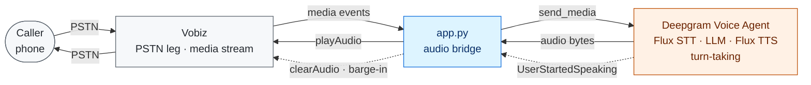
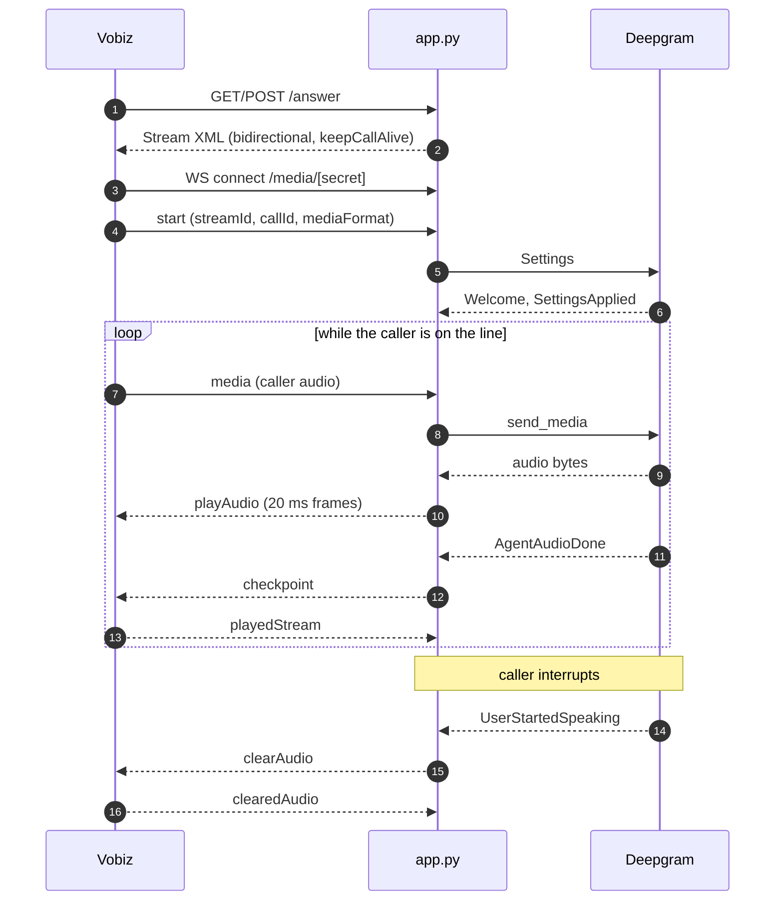
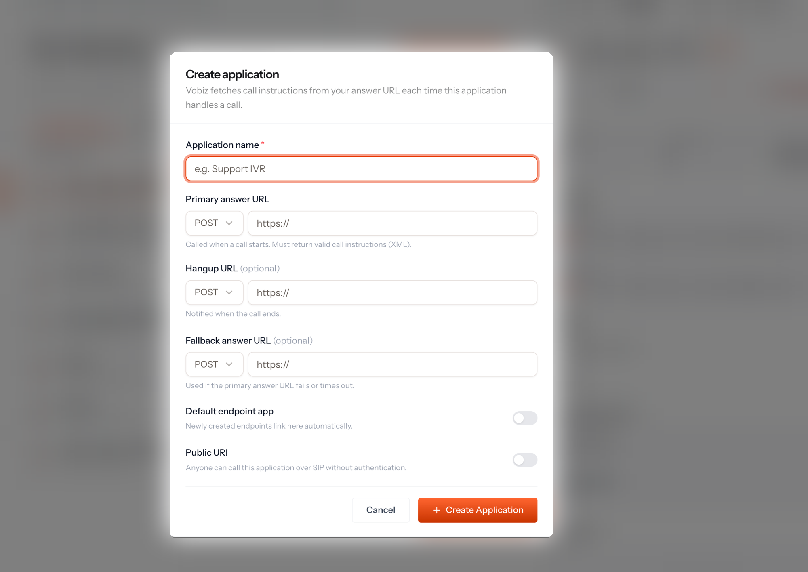
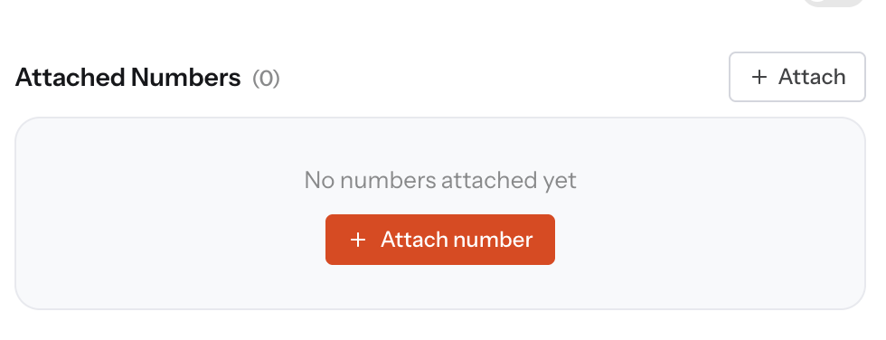

# Vobiz Deepgram Voice Agent

A real-time phone agent built on the [Vobiz](https://vobiz.ai) XML API and the
[Deepgram Voice Agent API](https://developers.deepgram.com/docs/voice-agent), configured for
Indian telephony. A caller dials a Vobiz number, speaks naturally, and can interrupt the agent
mid-sentence.

Vobiz streams the call audio over a bidirectional WebSocket. This server is a thin audio bridge —
it forwards the caller's audio into one Deepgram Voice Agent socket and plays the agent's audio
back. Deepgram runs the whole conversation loop: speech-to-text, the LLM, text-to-speech, and
turn-taking.

Out of the box it uses Deepgram's India region, an Indian-accented voice, and a keyterm list
tuned for Indian vocabulary.

## Architecture


```mermaid
flowchart LR
    caller(["Caller<br/>phone"])
    vobiz["Vobiz<br/>PSTN leg · media stream"]
    bridge["app.py<br/>audio bridge"]
    agent["Deepgram Voice Agent<br/>Flux STT · LLM · Flux TTS<br/>turn-taking"]

    caller -->|PSTN| vobiz
    vobiz -->|media events| bridge
    bridge -->|send_media| agent
    agent -->|audio bytes| bridge
    bridge -->|playAudio| vobiz
    vobiz -->|PSTN| caller

    agent -.->|UserStartedSpeaking| bridge
    bridge -.->|"clearAudio · barge-in"| vobiz

    classDef ext fill:#f6f8fa,stroke:#57606a,color:#24292f
    classDef ours fill:#ddf4ff,stroke:#0969da,color:#0a3069
    classDef dg fill:#fff1e5,stroke:#bc4c00,color:#6b2300
    class caller,vobiz ext
    class bridge ours
    class agent dg
```

Solid edges carry audio; dotted edges are the interrupt signal. Everything conversational lives
inside Deepgram — this server only moves audio between two sockets and relays one control event.

**A turn, end to end:**


```mermaid
sequenceDiagram
    autonumber
    participant V as Vobiz
    participant A as app.py
    participant D as Deepgram

    V->>A: GET/POST /answer
    A-->>V: Stream XML (bidirectional, keepCallAlive)
    V->>A: WS connect /media/[secret]
    V->>A: start (streamId, callId, mediaFormat)
    A->>D: Settings
    D-->>A: Welcome, SettingsApplied
    loop while the caller is on the line
        V->>A: media (caller audio)
        A->>D: send_media
        D-->>A: audio bytes
        A-->>V: playAudio (20 ms frames)
        D-->>A: AgentAudioDone
        A-->>V: checkpoint
        V-->>A: playedStream
    end
    Note over D,A: caller interrupts
    D-->>A: UserStartedSpeaking
    A-->>V: clearAudio
    V-->>A: clearedAudio
```

Deeper detail on region choice, model selection and turn-taking is in
[docs/PERFORMANCE.md](docs/PERFORMANCE.md).

## Quick Start

Requires **Python 3.10 or later** — `deepgram-sdk` 7.x declares `Requires-Python >=3.10`, so the `pip install` below is the first thing that fails on 3.9.

```bash
python3 -m venv .venv && source .venv/bin/activate
pip install -r requirements.txt
cp .env.example .env
```

Set the two required values in `.env`:

```bash
DEEPGRAM_API_KEY=your_key
PUBLIC_HOSTNAME=            # filled in below
```

Start a tunnel, since the server binds loopback:

```bash
cloudflared tunnel --url http://127.0.0.1:5050    # or: ngrok http 127.0.0.1:5050
```

Put the tunnel's host in `PUBLIC_HOSTNAME` (bare hostname, no scheme), then run:

```bash
python app.py
```

`GET /health` echoes the resolved region, models, voice and audio profile so you can confirm what
is actually in use.

> **Before you share that tunnel URL, set `STREAM_SECRET`.** An accepted `/media` socket opens a
> billed Deepgram session on your key, so while the secret is unset anyone who learns the hostname
> can start one. `openssl rand -hex 16` is enough. See [Security](#security).

## Inbound Calls

Vobiz decides what to do with an inbound call by looking up the **Voice Application** attached to
the number that was dialled, so a number alone is not enough.

### 1. Create a Voice Application

In the Vobiz console, go to **Voice Applications → Create application**. Set **Primary answer
URL** to `https://YOUR_HOST/answer` with method **POST**. Optionally set the **Hangup URL** to
`https://YOUR_HOST/hangup`.



### 2. Attach a number

Open the application and attach one of your DIDs under **Attached Numbers → Attach number**.



Dial the attached number with a `0` or `+91` prefix — `09XXXXXXXXX` or `+919XXXXXXXXX`. You
should hear the greeting.

## Outbound Calls

`call.py` places a call and points it at this server, so no Voice Application is needed:

```bash
python call.py --to +919XXXXXXXXX
python call.py --dry-run              # print the payload without dialling
```

`--from` overrides `FROM_NUMBER` and `--host` overrides `PUBLIC_HOSTNAME` for a one-off call.

## Endpoints

| Method | Path | Description |
|--------|------|-------------|
| GET/POST | `/answer` | Entry point — returns the `<Stream>` XML |
| WS | `/media/<secret>` | Bidirectional media stream |
| POST | `/stream-status` | `<Stream statusCallbackUrl>` — StartStream, PlayedStream, ClearedAudio, StopStream |
| POST | `/hangup` | Call-ended webhook |
| GET | `/health` | Resolved region, locale, models, audio profile |

## Language and Voice

Deepgram's Indian-language recognition is broad: Flux STT Multilingual understands Hindi, and
Nova-3 adds Tamil, Telugu, Marathi, Bengali, Gujarati, Punjabi, Kannada, Assamese and Urdu. On the
speech side, the models built for this audience are Deepgram's **Indian-accented English voices** —
so the design that gets the most out of the stack is to understand the caller in their language and
answer in Indian-accented English. That is what every locale below does.

The voices:

| Voice | |
|---|---|
| `flux-meena-en` | female — customer service, casual chat (default) |
| `flux-priya-en` | female — IVR, confident and reassuring |
| `flux-naveen-en` | male — IVR, support, informative |

So **every locale replies in English**, and the Indian character comes from the voice — which, on a
call, is what carries it. Set `DG_TTS_MODEL` to pick a different one. Keep replies in English rather
than romanised Hindi: these are English voice models, and we measured what happens when you don't —
see [docs/PERFORMANCE.md](docs/PERFORMANCE.md#why-every-locale-replies-in-english).

| `AGENT_LOCALE` | Understands | Replies in |
|---|---|---|
| `en-in` (default) | English | English, Indian accent |
| `hi-in` | Hindi and English, including mid-sentence code-switching | English, Indian accent |
| `indic` | one Indic language (set `INDIC_LANGUAGE`) | English, Indian accent |
| `en-us` | English | English, American accent |

`en-in` is the default because the monolingual Flux model has the tightest end-of-turn behaviour.
Use `hi-in` when callers code-switch. The `indic` locale reaches nine more languages through Nova,
which brings its own endpointing rather than Flux's — a fair trade when you need that coverage.

Recognition is biased toward Indian vocabulary with a keyterm list — Aadhaar, UPI, PAN card, GST,
IFSC, RuPay, lakh, crore, KYC, OTP and major city names. Edit `INDIA_KEYTERMS` in `app.py` to add
your own product and domain words. Brand names repay this the most: an invented name is
out-of-vocabulary for any recogniser, and it is the word your agent says most often.

## Configuration

**Required**

| Variable | Description |
|----------|-------------|
| `DEEPGRAM_API_KEY` | Runs the whole agent — STT, LLM, and TTS |
| `PUBLIC_HOSTNAME` | Public host Vobiz reaches. Bare hostname; a scheme or trailing slash is stripped, a path is rejected |

**Region, language and voice**

| Variable | Default | Description |
|----------|---------|-------------|
| `DEEPGRAM_REGION` | `india` | `india` (`api.in.deepgram.com`, AWS ap-south-2) or `global` |
| `AGENT_LOCALE` | `en-in` | `en-in`, `hi-in`, `indic`, `en-us` |
| `INDIC_LANGUAGE` | `ta` | Only for `AGENT_LOCALE=indic`: `ta`, `te`, `mr`, `bn`, `gu`, `pa`, `kn`, `as`, `ur` |
| `DG_TTS_MODEL` | per locale | Override the voice |
| `GREETING` | per locale | Override the first thing the caller hears |

**Language model** — all Deepgram-managed, so no provider key is needed

| Variable | Default | Description |
|----------|---------|-------------|
| `LLM_PROVIDER` | `anthropic` | `anthropic`, `open_ai`, `google`, `nvidia` |
| `LLM_MODEL` | `claude-haiku-4-5` | Chosen for response speed and consistency on a voice call |

**Turn-taking** — Flux only; the `indic` locale uses Nova, which does its own endpointing

| Variable | Default | Description |
|----------|---------|-------------|
| `EOT_THRESHOLD` | `0.7` | Confidence needed to end a turn, `0.5`–`1.0`. Raise it on a noisy line so crosstalk is less likely to be read as the caller's turn |
| `EOT_TIMEOUT_MS` | `3000` | End the turn this long after speech regardless of confidence |
| `EAGER_EOT_THRESHOLD` | `0.4` | Begin generating the reply on a medium-confidence turn end, `0.3`–`0.9`, or `0` to disable |

**Transport**

| Variable | Default | Description |
|----------|---------|-------------|
| `HTTP_PORT` | `5050` | Server port |
| `BIND_HOST` | `127.0.0.1` | Bind address. Loopback assumes a tunnel in front |
| `DEV_RELOAD` | unset | Set to enable uvicorn's auto-reloader. Off by default — a reload drops every live call |
| `AUDIO_MODE` | `mulaw` | `mulaw` or `l16` |
| `CLEAR_ACK_TIMEOUT_S` | `1.0` | How long to wait for `clearedAudio` before resuming playback anyway |

**Security** — both off until configured

| Variable | Description |
|----------|-------------|
| `STREAM_SECRET` | ASCII-alphanumeric secret placed in the media stream's URL path and checked at the handshake, before the socket is accepted and before any Deepgram session opens |
| `VERIFY_SIGNATURE` | `true` to validate the `X-Vobiz-Signature-V3`/`V2` HMAC on all three webhooks, keyed by `VOBIZ_AUTH_TOKEN` |

**Outbound calls** — `call.py` only; inbound needs none of these

| Variable | Description |
|----------|-------------|
| `VOBIZ_AUTH_ID` | Vobiz account auth ID |
| `VOBIZ_AUTH_TOKEN` | Vobiz auth token; also the webhook signing key |
| `FROM_NUMBER` | A DID this account owns |
| `TO_NUMBER` | Default destination for `call.py` |

## India vs global

`DEEPGRAM_REGION=india` points every Deepgram connection at `api.in.deepgram.com`
(AWS `ap-south-2`, Hyderabad) instead of Deepgram's default hosts. For calls that terminate in
India this is the single highest-leverage setting in the file:

| | `india` | `global` |
|---|---|---|
| Endpoint | `api.in.deepgram.com` | `api.deepgram.com` / `agent.deepgram.com` |
| Region | AWS ap-south-2, Hyderabad | nearest of Deepgram's default regions |
| Round trip from India | short | crosses out of the country and back |
| Time to first audio, measured from Bengaluru | **~0.4 s** | ~1.5 s |
| Audio, transcripts, synthesis | stay in India | leave the country |
| Models | same on both | same on both |
| Pricing | same on both | same on both |
| API keys and SDK code | unchanged | unchanged |

On a phone call that difference is not a metric, it is the gap between a natural reply and a
pause the caller notices. Set `DEEPGRAM_REGION=global` if you are serving callers elsewhere.

Two caveats before promising full data residency: the LLM step runs wherever that model provider
runs, which is outside India, and operational metadata and billing are processed in the US.

Note that the SDK takes the Voice Agent host from `environment.agent`, which is a *different* host
from the REST base, so selecting a region means overriding the whole environment rather than just
a base URL. `app.py` does this for you.

## Audio

The two directions are configured independently. Both profiles are pure passthrough — this app
never resamples.

| `AUDIO_MODE` | Vobiz → app (`<Stream contentType>`) | app → Vobiz (`playAudio`) |
|---|---|---|
| `mulaw` (default) | `audio/x-mulaw;rate=8000` | mu-law 8000 |
| `l16` | `audio/x-l16;rate=16000` | L16 24000 |

`playAudio` accepts L16 at 8/16/24 kHz and mu-law at 8 kHz. Do **not** put `rate=24000` in
`<Stream contentType>` — that attribute configures the *inbound* direction, which tops out at
16 kHz. 24 kHz is outbound-only.

Deepgram streams audio in chunks sized for throughput. `VobizStream.play()` re-slices them so every
frame sent is exactly 20 ms — 160 bytes mu-law at 8 kHz, 960 bytes L16 at 24 kHz — which is what
Vobiz wants for responsive barge-in.

## XML Elements Used

- `<Stream bidirectional="true">` — two-way audio over WebSocket; required for `playAudio`,
  `clearAudio` and `checkpoint`
- `<Stream keepCallAlive="true">` — holds the call open for the life of the stream
- `<Stream audioTrack="inbound">` — the only track setting valid alongside `bidirectional`
- `<Hangup>` — ends the call once the stream closes

## Stream Events

| Direction | Event | Purpose |
|-----------|-------|---------|
| Vobiz → app | `start` | Stream opened; carries `streamId`, `callId`, `mediaFormat` |
| Vobiz → app | `media` | Base64 caller audio |
| Vobiz → app | `playedStream` | Checkpoint reached — the caller heard the audio |
| Vobiz → app | `clearedAudio` | Buffered audio was flushed |
| Vobiz → app | `stop` | Stream ended |
| app → Vobiz | `playAudio` | Agent audio to play to the caller |
| app → Vobiz | `clearAudio` | Interrupt — drop buffered audio (barge-in) |
| app → Vobiz | `checkpoint` | Mark the end of a turn |

## Testing Without a Call

`mock_vobiz.py` stands in for Vobiz — it speaks the media-stream protocol against a running
`app.py`, answers `checkpoint` with `playedStream`, and reports what came back.

```bash
python mock_vobiz.py                        # 4s of silence — transport and greeting
python mock_vobiz.py --wav question.wav     # stream a real question
```

It reports `PASS` whenever `playAudio` frames were returned, and prints the formats, frame count,
checkpoints and time-to-first-audio for you to read. It does not assert that the format matches
what the XML requested, so read the printed output rather than relying on the exit code.

`--wav` takes audio that already matches the profile, because nothing in the mock resamples or
transcodes — the encoding, channel count and sample rate are read from the RIFF header and a
mismatch is refused with the `ffmpeg` line that would fix it:

| `AUDIO_MODE` | Expected file |
| --- | --- |
| `mulaw` (default) | mu-law WAV, mono, 8 kHz — `ffmpeg -i in.wav -ar 8000 -ac 1 -c:a pcm_mulaw out.wav` |
| `l16` | 16-bit PCM WAV, mono, 16 kHz — `ffmpeg -i in.wav -ar 16000 -ac 1 -c:a pcm_s16le out.wav` |

A headerless `.ulaw`, `.raw`, `.pcm` or `.l16` file is also accepted and taken on trust, since
there is no header to check it against.

## Notes

Five behaviours are worth knowing before changing anything:

- **`keepCallAlive="true"` is mandatory.** Without it the `<Stream>` element returns immediately,
  the document ends, and Vobiz hangs up on *End Of XML Instructions*.
- **`audioTrack="both"` is rejected** when `bidirectional="true"`. Use `inbound`.
- **`extraHeaders` cannot authenticate the media socket.** The values never reach the WebSocket —
  not as an upgrade header, and not in the `start` frame, whose `extra_headers` field stays the
  literal `"{}"`. They surface only in the `statusCallbackUrl` payload, as `X-VH-<key>`. That
  makes `extraHeaders` status-callback metadata rather than stream credentials, so `STREAM_SECRET`
  rides in the WebSocket URL path instead.
- **The webhook signature covers the URL and a nonce, never the body.** Voice webhooks are
  form-encoded, so any scheme that hashes a JSON body will not verify. Query parameters are
  stripped first, and behind a tunnel the public URL has to be rebuilt — `request.url` is the
  internal address Vobiz never saw. Signature headers are only emitted when the callback URL has
  auth credentials configured on it, which is why `VERIFY_SIGNATURE` is opt-in.
- **New playback waits for `clearedAudio`.** Sending `playAudio` straight after `clearAudio` lets
  the new audio race the in-flight flush and be partially dropped, which the caller hears as the
  next reply starting mid-word. Audio arriving during a flush is held and released on the
  acknowledgement, with `CLEAR_ACK_TIMEOUT_S` as a backstop.

## Security

Three separate mechanisms, guarding two different doors.

| | Protects | Set by |
| --- | --- | --- |
| `VERIFY_SIGNATURE` | the three HTTP webhooks | `VOBIZ_AUTH_TOKEN`, plus callback auth credentials on the URL in the console |
| `STREAM_SECRET` | the `/media` WebSocket | a random value in `.env`, checked before `accept()` |
| TLS | everything | your tunnel or load balancer |

**What the webhook signature proves.** That the request was made by someone holding your account
auth token, for that exact URL. It is HMAC-SHA256 over `baseURL + nonce` (V2) or
`baseURL + "." + nonce` (V3), compared in constant time.

**What it does not prove — read this before relying on it.** Vobiz sends a random nonce and *no
timestamp*, and the signature does not cover the request body. So:

- **A captured request verifies forever.** There is nothing in the signed material to check
  freshness against, so anyone who records one signed `/answer` request off the wire can replay it
  indefinitely. Rate-limit and monitor `/answer` if that matters to you; the signature will not
  stop it.
- **The body is unsigned.** Every form field — `CallUUID`, `From`, `To` — is attacker-controllable
  on a replayed or forged request. Do not use webhook parameters as an authorisation decision.
- **Signature headers only appear when the callback URL has auth credentials configured** in the
  Vobiz console. That is why `VERIFY_SIGNATURE` is opt-in rather than on by default: turning it on
  without configuring them 403s every call. The log distinguishes the two cases.

`STREAM_SECRET` is the stronger of the two, and it is why the secret rides in the WebSocket path:
`extraHeaders` never reaches the socket (see [Notes](#notes)), so the path is the only place the
media server can carry a credential. Rotating it is a one-line `.env` change and a restart.

## Troubleshooting

| Symptom | Cause |
|---|---|
| Call hangs up immediately, log shows *End Of XML Instructions* | `keepCallAlive="true"` missing, or `audioTrack="both"` with `bidirectional="true"` |
| Silence in both directions | `bidirectional="true"` missing — `playAudio` is ignored on a one-way stream |
| Garbled or chipmunk audio | `<Stream contentType>` and `AUDIO_MODE` disagree. The app prints `[audio] WARNING` on the start event when the reported `mediaFormat` does not match |
| Speech sounds slow, stretched or broken | The voice is being given non-English text. Flux voices are English models, so keep replies in English and let the Indian character come from the voice itself |
| Replies feel sluggish | Read the `[latency]` line to see which stage is responsible, then change `LLM_MODEL` if the language model dominates |
| Agent talks over the caller | `clearAudio` is not reaching Vobiz — check `streamId` is set before the first `playAudio` |
| Agent cuts the caller off mid-sentence | `EOT_THRESHOLD` too low for the line, or `EOT_TIMEOUT_MS` too short. Raise both |
| Brand or domain words need a hint | Add them to `INDIA_KEYTERMS` in `app.py` — that is exactly what keyterms are for |
| WebSocket closes with 1008 | `STREAM_SECRET` does not match the secret in the stream URL path |
| Startup exits with *STREAM_SECRET must be ASCII alphanumeric* | The secret becomes a URL path segment and is compared byte-wise; a non-ASCII character would make every call fail |
| `/answer` returns 403 | `VERIFY_SIGNATURE=true` but the callback URL has no auth credentials configured, so no signature headers are sent. The log distinguishes this from a genuine mismatch |
| Startup exits naming `PUBLIC_HOSTNAME` | It is unset, still the placeholder, or contains a path |
| Outbound call returns 401 or 402 | `401` credentials, `402` balance. *"from number … not owned"* means the DID belongs to another account |
| Inbound call is never answered | The number has no Voice Application attached, or its answer URL does not point at this server |
| Inbound call does not connect | Dial the number with a `0` or `+91` prefix |

## Resources

- [Vobiz `<Stream>` element](https://www.vobiz.ai/docs/xml/stream)
- [Vobiz stream events](https://www.vobiz.ai/docs/xml/stream/stream-events)
- [Vobiz `playAudio`](https://www.vobiz.ai/docs/xml/stream/play-audio)
- [Vobiz `clearAudio`](https://www.vobiz.ai/docs/xml/stream/clear-audio)
- [Vobiz callback validation](https://www.vobiz.ai/docs/concepts/validating-callbacks)
- [Deepgram Voice Agent API](https://developers.deepgram.com/docs/voice-agent)
- [Deepgram Voice Agent settings](https://developers.deepgram.com/docs/configure-voice-agent)
- [Deepgram Voice Agent LLM models](https://developers.deepgram.com/docs/voice-agent-llm-models)
- [Deepgram Flux (conversational STT)](https://developers.deepgram.com/docs/flux/feature-overview)
- [Deepgram Flux TTS voices](https://developers.deepgram.com/docs/flux-tts/voices)
- [Deepgram multilingual voice agents](https://developers.deepgram.com/docs/multilingual-voice-agent)
- [Deepgram India endpoint](https://deepgram.com/learn/deepgram-india-endpoint-now-generally-available)

---

## Built by Team Vobiz

[Vobiz](https://vobiz.ai) is a programmable voice & SIP-trunking platform. This reference
implementation is maintained by the Vobiz team.

Author: **Piyush Sahoo** — [LinkedIn](https://www.linkedin.com/in/piyush-s713/)

## License

[MIT](./LICENSE) © Vobiz
